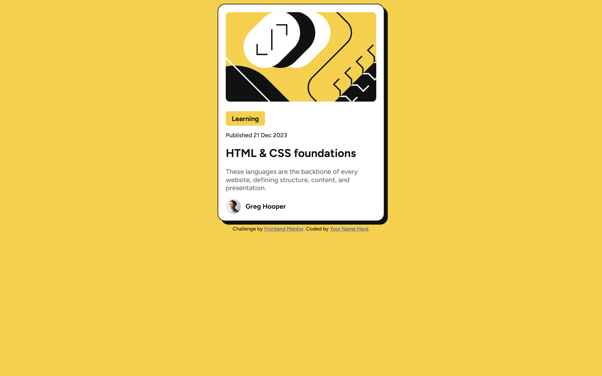

# Frontend Mentor - Blog preview card solution

This is a solution to the [Blog preview card challenge on Frontend Mentor](https://www.frontendmentor.io/challenges/blog-preview-card-ckPaj01IcS). Frontend Mentor challenges help you improve your coding skills by building realistic projects. 

## Table of contents

- [Overview](#overview)
  - [The challenge](#the-challenge)
  - [Screenshot](#screenshot)
  - [Links](#links)
  - [Built with](#built-with)
- [Author](#author)

### The challenge

Users should be able to:

- See hover and focus states for all interactive elements on the page

### Screenshot

### Links

- Solution URL: [Vercel](https://blog-preview-card-main-sable-mu.vercel.app/)
- Live Site URL: [mmalabugin.ru/BlogPreviewCard](https://mmalabugin.ru/BlogPreviewCard)

### Built with

- Semantic HTML5 markup
- CSS custom properties
- Flexbox
- CSS Grid
- Mobile-first workflow

## Author

- Website - [mmalabugin.ru](https://mmalabugin.ru)
- Frontend Mentor - [@1t1sCooL](https://www.frontendmentor.io/profile/1t1sCooL)
- Twitter - [@vi_el_mar](https://www.twitter.com/vi_el_mar)
- Telegram - [@ItIsCooL](https://t.me/ItIsCooL)
